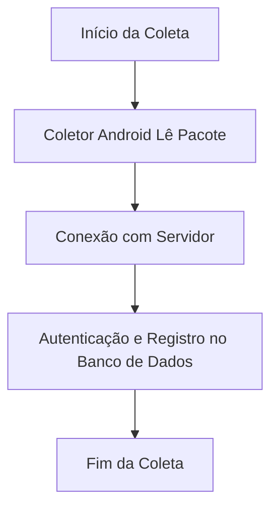

# Documentação da Implementação do Sistema

Dado que essa parte teria que fazer internamente, eu vou apenas documentar as sugestões de implementações e as ideias que estou tendo para o uso.

No caso, seria rodar esse software em um servidor interno que configuraria a API Restful e hospedaria o banco de dados. 

Penso que não haveria necessidade de tocar no WMS, já que seria um processo interno. A única coisa que teria de ser feita é liberar uma porta para esse servidor.  Bom, aqui não é minha ossada, então nem arrisco

**PS:** E sim, gosto de ficar imaginando cenários adaptativos seguindo padrões de redundância.

**PS2:** Desculpa a falta de profissionalismo, é que não quero me levar tão a sério. Kkkkkkk!

Lógico, só teria que estudar uma possível derrubada do WMS por números de requisições, mas isso é bem depois.

## Diagrama de Implementação



# Para implementação:

```mermaid
graph TD;
    A[Inicio] --> B[Criar Controller para Endpoints usando Spring ou Express]
    B --> C[Configurar Banco de Dados]
    C --> D[Executar a Aplicação]
    D --> E[Testar os Endpoints]
    E --> F[Conectar ao Servidor com o Coletor Android]
    F --> G[Fim]


