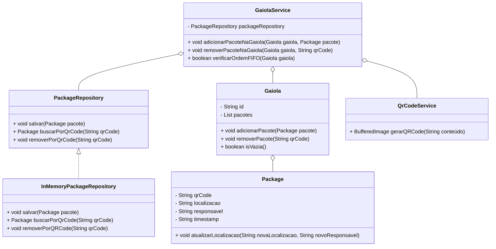

# Sistema de gerenciamento interno de logistica com WMS implementado

Bom, só para mostrar como eu sou foda, e tb pq é um puta erro algumas pessoas me mandarem calar a boca, tá aqui um sistema que resolve o problema da ordem de FIFO na Shoppe, e dado que sou um peão temporario meia boca com uma infancia fodida, isso só deixa mais incrivel. Sim, sei que falar desse jeito é falta de profissionalismo, mas acontece que se aguentei uma enrrabada da vida e fiz um puta bagulho complexo com meia duzia de interação e muita genialidade, posso dizer que convenções sociais são bestas perante da genialidade.

Devo tudo as minhas relações, principalmente com a liderança, dado que posso ter as melhores ideias do mundo, mas se não forem revisadas por pessoas que sabem o que pode dar errado, pode virar um tumor. Obrigado Sandro, Chiquinho e Yasmin, se quiserem referencia ou participar, caso vá para frente e vire um projeto grande, vocês merecem os creditos também.

## Desculpa o complexo de deus, é q fiz essa porra lombrado kkkkkkk

## Funcionalidades

- **Criação Automática de Pacotes**: No caso, dado a popularidade do QR code, penso num sistema que poderia cruzar informações do ID do coletor com o setor, e caso seja o primeiro, crie o pacote na memoria e defina o peso dele em função de dias, para otimização, da para roturlar em categorias, caso demore meses de transito. 
  
- **Atualização de Localização e Setor**: Um coletor pode atualizar as informações de localização e setor. Menos trabalho pro sistema, dado que ao sobrepor, você não cria necessidades de recursos.

- **Destruição de Pacotes**: QDado que a falta de um sistema interno de Banco de Dados é desnecessário para operação, poderiamos manter assim, só terimaos de definir um esquema de rastreio interno, que não precisa de conexão direta com WMS, apagando da memoria, assim, ao inves de armarzenar um volume gigantesco de pacotes, você distribui entre quem entra e apaga que sai. Tipo, ao inves de armazenar 1 milhão, armazena 30 mil.

## Diagrama

## Contribuições
Mais uma vez, caso qualquer um tenha uma ideia, fique a vontade para me chamar, não sendo meia noite, tá suave kkkk
E um agradecimento a:
Chico 
Sandro
Yasmin
(Pe passem o Linkedin para referencia)

## Licença
Esse projeto é licenciado sob a MIT License. Se você não sabe o que isso significa, basicamente, você pode fazer o que quiser com isso, só não venha me processar, beleza?

PS: Projeto só pra mostrar o tamanho da minha pika, já que não está rolando remuneração, apenas o mérito, então vou curtir kkkk
