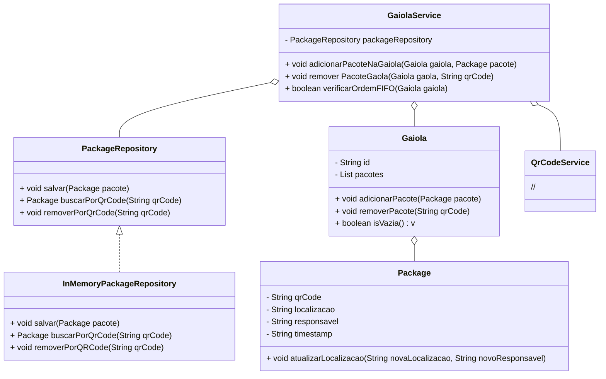

# Sistema de gerenciamento interno de logistica com WMS implementado

Agora que estou mais calmo, posso dizer o proposito desse projeto kjkkkkkk

O sistema é basicamente um prototipo de como implementar um sistema de localização, onde um pacote é representado na memoria, e através de parametros, localiza-lo, além de ter embutido um sistema de paletização através de gaiolas.

Pensei em orientação a objetos, por ser mais pragimatico e facil de implementar.

## Funcionalidades

- **Criação Automática de Pacotes**: No caso, dado a popularidade do QR code, penso num sistema que poderia cruzar informações do ID do coletor com o setor, e caso seja o primeiro, crie o pacote na memoria e defina o peso dele em função de dias, para otimização, da para roturlar em categorias, caso demore meses de transito. 
  
- **Atualização de Localização e Setor**: Um coletor pode atualizar as informações de localização e setor. Menos trabalho pro sistema, dado que ao sobrepor, você não cria necessidades de recursos.

- **Destruição de Pacotes**: QDado que a falta de um sistema interno de Banco de Dados é desnecessário para operação, poderiamos manter assim, só terimaos de definir um esquema de rastreio interno, que não precisa de conexão direta com WMS, apagando da memoria, assim, ao inves de armarzenar um volume gigantesco de pacotes, você distribui entre quem entra e apaga que sai. Tipo, ao inves de armazenar 1 milhão, armazena 30 mil.

## Diagrama

## Contribuições
Mais uma vez, caso qualquer um tenha uma ideia, fique a vontade para me chamar, não sendo meia noite, tá suave kkkk

## Licença
Esse projeto é licenciado sob a MIT License. Se você não sabe o que isso significa, basicamente, você pode fazer o que quiser com isso, só não venha me processar
